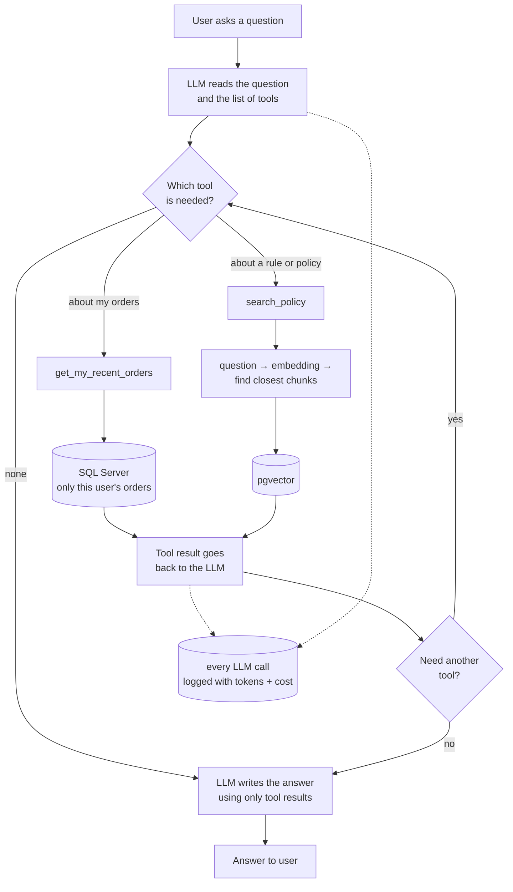

 # Samagra

A full-stack e-commerce platform built to work through production patterns in .NET —
and to explore how AI features fit into an existing architecture rather than being
bolted on the side.

## Tech Stack

**Backend** — .NET 10, ASP.NET Core Web API, Clean Architecture (Domain / Application / Infrastructure / AI / API)
**Frontend** — React
**Data** — SQL Server (EF Core), PostgreSQL + pgvector
**Caching** — Redis, HybridCache (L1 memory + L2 Redis)
**Auth** — JWT in HttpOnly cookies, ASP.NET Identity with roles
**AI** — Azure OpenAI (gpt-4.1-mini, text-embedding-3-small), Microsoft.Extensions.AI
**Observability** — Application Insights
**CI** — GitHub Actions

---

## AI Assistant

The AI layer lives in its own project, `Samagra.AI`, and connects to the rest of the
system only through interfaces defined in the Application layer. The API project never
references an Azure SDK.

### How a question flows



### RAG over pgvector

Documents are split into overlapping chunks, embedded, and stored in PostgreSQL with
pgvector. At query time the question is embedded with the same model and matched by
cosine distance.

Results above a distance threshold are dropped before the prompt is built, so unrelated
chunks never reach the model — cheaper, and less room to hallucinate. The model is
instructed to answer only from the retrieved context, cite its source, and say
"I don't have that information" when the context doesn't cover the question.

Chunk size is a real trade-off. Large chunks mix several topics and dilute the embedding —
correct matches were scoring around 0.67 cosine distance. Smaller chunks tighten that
considerably but risk cutting a sentence in half, which is what the overlap is for.

### Function calling

C# methods are exposed as tools with descriptions the model reads to decide what to call.
The model never executes anything — it returns a request, and the pipeline runs the method
and feeds the result back.

The signed-in user's id is never a tool parameter. It comes from `HttpContext` inside the
tool, and every order query filters by it, so the model cannot be prompted into reading
another customer's data. Order-by-id lookups still check ownership before returning
anything.

### Multi-step agents

Policy search is exposed as a tool alongside the order tools, so the model picks its own
path — database, documents, or both. It also chains calls: looking up a recent order,
then using that order id to fetch the items in it.

### Cost control

Token usage and cost are tracked as middleware on the chat client pipeline rather than
inside each feature, so every call is metered automatically — including features added
later. A budget guard sits in front of it and rejects requests once a user passes their
daily limit, before any tokens are spent.

```
BudgetGuard → FunctionInvocation → CostTracking → Azure OpenAI
```

Order matters. The budget guard is outermost so it checks once per question. Cost tracking
is innermost so each round-trip in the tool loop is metered separately — a three-step
answer produces three rows, not one.

Because the middleware is a singleton and the usage recorder depends on a scoped
`DbContext`, the recorder is resolved through `IServiceScopeFactory` per call rather than
injected — the same pattern you need inside a `BackgroundService`.

---

## Running locally

**1. Start the databases**

```bash
docker compose up -d
```

**2. Enable pgvector**

```bash
docker exec -it samagra-pgvector psql -U postgres -d samagra_vectors
```
```sql
CREATE EXTENSION IF NOT EXISTS vector;
```

**3. Configure secrets**

Copy `appsettings.Development.json.example` to `appsettings.Development.json` and fill in
your SQL Server connection string, JWT signing key, and Azure OpenAI endpoint and key.

**4. Apply migrations and run**

```bash
dotnet ef database update --project Samagra.Infrastructure --startup-project Samagra.API
dotnet run --project Samagra.API
```

Swagger is at `http://localhost:5109/swagger`.

---

## API

| Endpoint | What it does |
|---|---|
| `POST /api/ai/ask` | Plain chat, no retrieval |
| `POST /api/ai/ask-rag` | Answers from indexed documents only |
| `POST /api/ai/ask-tools` | Full assistant — picks tools, chains them, answers |
| `POST /api/ai/index` | Indexes a document into pgvector (admin) |
| `GET /api/admin/ai-usage?days=7` | Cost and token report by feature, day and user (admin) |

---

## Roadmap

See [ROADMAP.md](ROADMAP.md).
